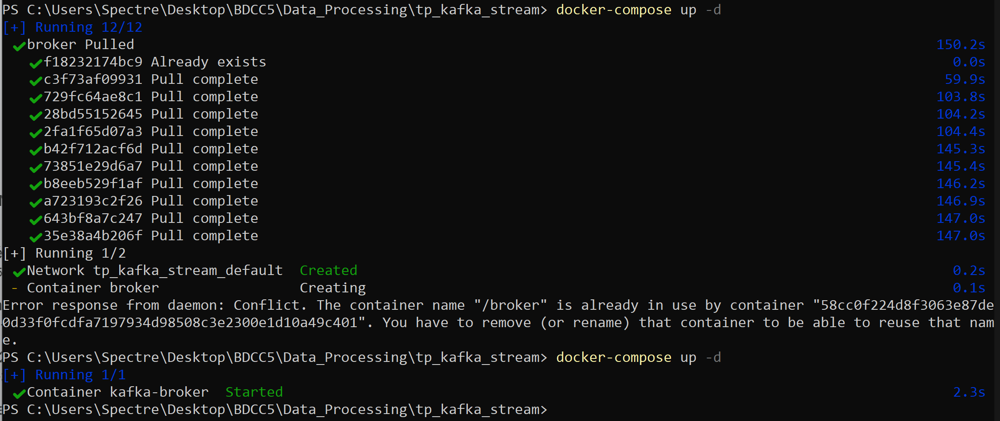
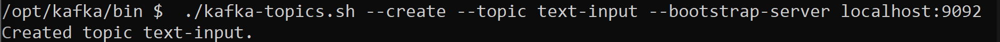
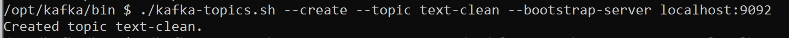
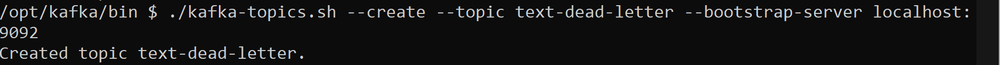
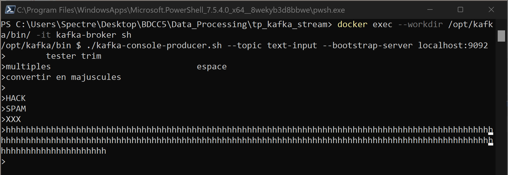
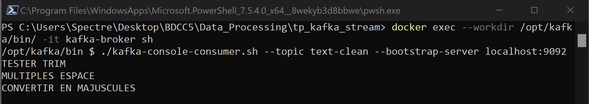
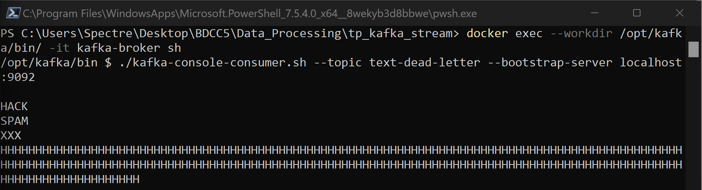

# Kafka Streams Text Processing Application

## 1. Description de l’application

Cette application Kafka Streams lit des messages texte depuis un topic Kafka, effectue un **nettoyage et un filtrage** des messages, puis les route vers des topics appropriés :

**Fonctionnalités :**

1. Lire les messages du topic `text-input`.
2. Nettoyer les messages :

   * Supprimer les espaces avant/après (trim)
   * Remplacer les espaces multiples par un seul espace
   * Convertir la chaîne en majuscules
3. Filtrer les messages :

   * Rejeter les messages vides ou constitués uniquement d’espaces
   * Rejeter les messages contenant des mots interdits (`HACK`, `SPAM`, `XXX`)
   * Rejeter les messages dépassant 100 caractères
4. Routage des messages :

   * Messages valides → topic `text-clean`
   * Messages invalides → topic `text-dead-letter`


## 2. Configuration de Kafka avec Docker

Nous utilisons Docker Compose pour lancer Kafka.

```bash
docker-compose up -d
```


## 3. Création des topics

Après avoir lancé Kafka, créez les topics nécessaires :

```bash
docker exec --workdir /opt/kafka/bin/ -it kafka-broker sh
```
• text-input



• text-clean



• text-dead-letter




## 5. Tests et cas d’utilisation
**Screenshot des messages dans `text-input` :**



### 5.1 Messages valides → `text-clean`
   * Supprimer les espaces avant/après (trim)
   * Remplacer les espaces multiples par un seul espace
   * Convertir la chaîne en majuscules

**Screenshot des messages dans `text-clean` :**




### 5.2 Messages invalides → `text-dead-letter`
   * Rejeter les messages vides ou constitués uniquement d’espaces
   * Rejeter les messages contenant des mots interdits (`HACK`, `SPAM`, `XXX`)
   * Rejeter les messages dépassant 100 caractères

**Screenshot des messages dans `text-dead-letter` :**



